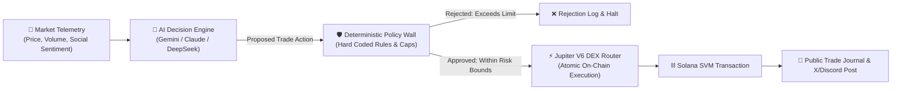

# ⚡ Sovereign Agent: Autonomous On-Chain AI Treasury & Trading Agent

> **An autonomous economic agent for Solana with a native keypair, non-custodial execution guardrails ("Deterministic Policy Wall"), Jupiter V6 routing, and public social trade syndication.**

[](https://solana.com)
[](#the-core-philosophy)
[](https://jup.ag)
[](LICENSE)

---

## 🌟 The Vision

AI agents are transitioning from passive chat assistants to **sovereign economic actors** with financial agency. Traditional trading bots are rigid, lack strategic contextual reasoning, and expose users to flash-crash bugs. Unconstrained LLMs, conversely, cannot be trusted with raw private keys without hard execution boundaries.

**Sovereign Agent** implements the golden paradigm: **"The Model Proposes, Deterministic Code Disposes."**



---

## 🛡️ The Deterministic Policy Wall

No matter what the LLM hallucinates or suggests, **no trade can execute unless it passes every check in the deterministic code layer**:

1. **Token Allowlist Only**: Trades can only occur between verified mints (SOL, USDC, JUP, BONK, RENDER, etc.). Unverified meme contracts or honeypots are rejected at the bytecode level.
2. **Maximum Single-Trade Cap**: Default maximum per trade is 1.0 SOL or 5% of total portfolio value.
3. **Daily Drawdown Circuit Breaker**: If portfolio drawdown exceeds 8% within 24 hours, all execution locks automatically for 24 hours.
4. **Max Slippage Guard**: Hard 1.5% maximum slippage on all routes to prevent MEV sandwich attacks.
5. **No External Transfer Authority**: The agent's wallet signing privileges are strictly restricted to swap instructions. It cannot transfer assets to arbitrary external wallets.

---

## 🛠️ Project Structure

```bash
sovereign_agent/
├── README.md
├── requirements.txt
├── config.py                 # Network endpoints, token allowlist, hard risk limits
├── run_agent.py              # Main CLI execution loop & simulation runner
├── src/
│   ├── agent.py              # LLM reasoning & market signal evaluation
│   ├── policy_engine.py      # Hardcoded deterministic risk & guardrail wall
│   ├── dex_router.py         # Jupiter V6 swap quote & transaction builder
│   └── journal.py            # Public trade logger, performance tracker & X publisher
└── tests/
    └── test_policy_engine.py # Safety unit tests for guardrail compliance
```

---

## 🚀 Quickstart

### 1. Installation
```bash
cd sovereign_agent
python3 -m venv venv
source venv/bin/activate
pip install -r requirements.txt
```

### 2. Run Test Suite
Verify that all deterministic risk limits and guardrails pass:
```bash
python3 -m unittest tests/test_policy_engine.py
```

### 3. Run Agent in Simulation Mode
```bash
python3 run_agent.py --mode simulation
```

---

## 🗺️ Roadmap
- [x] Deterministic Policy Engine & Risk Guardrails.
- [x] Jupiter V6 DEX quote routing simulation.
- [x] Trade journaling & social post formatting.
- [ ] On-chain Community Vault PDA (users deposit SOL, agent trades with LP protection).
- [ ] Solana Blinks integration: 1-click Twitter copy-trade links for community members.
- [ ] Multi-agent committee: 3 specialized LLMs (Macro Analyst, Momentum Scanner, Risk Officer) vote before proposing trades.
